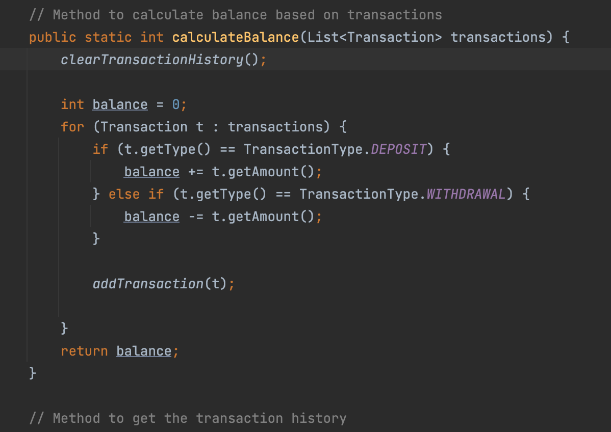
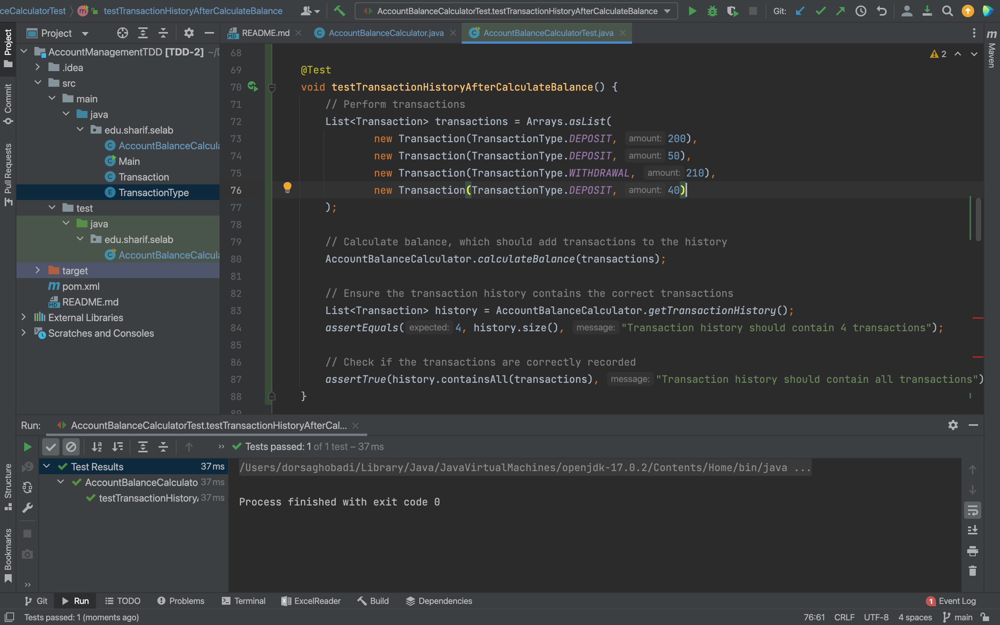
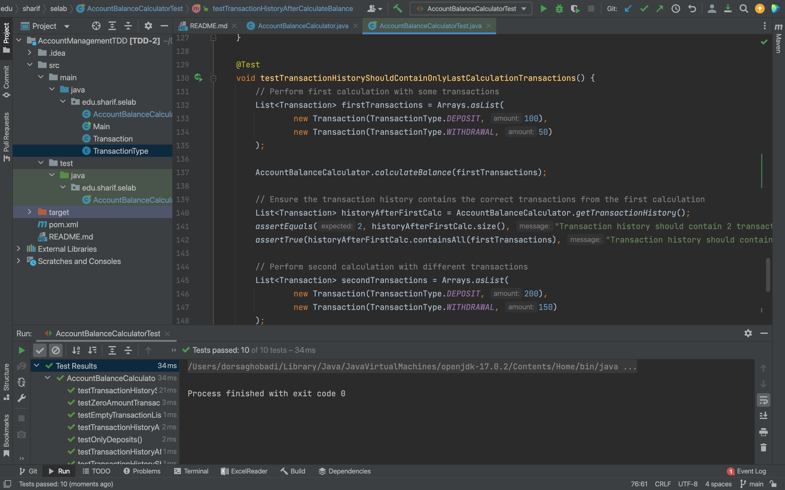

# مدیریت حساب بانکی  

## بخش اول 

# پرسش اول   

خطای موجود در کد این است که در تابع `calculateBalance`، 
انتظار می رود که اولا، تاریخچه تواکنش ها پاک و خالی شود، ثانیا باید بعد از حساب کردن موجودی بعد از هر تراکنش ، آن تراکنش به لیست سوابق افزوده شود که این اتفاق نیوفتاده است.  
دلیل دیده نشدن این مشکل میتواند این باشد که `coverage` کد صددرصد نیست، یعنی توابعی مانند `clearTransactionHistory`یا `addTransaction` وجود دارند که تست نشده اند که این احتمال وجود خطا را بالا می برد.
# پرسش دوم
برای آن که تستی بنویسیم که مردود شود و خطا را نشان دهد، کافیست که یک سری تراکنش انجام دهیم، سپس موجودی را حساب کنیم و در آخر چک کنیم که آن تراکنش ها در سوابق تراکنش وجود دارند یا نه.  
این تست در تابع `testTransactionHistoryAfterCalculateBalance` قابل مشاهده است.  
قبل از اصلاح کد، تست مردود می شد که در تصویر زیر قابل مشاهده است:  
  

سپس، کد را اصلاح میکنیم ، به این صورت که در تابع`calculateBalance` ، باید اولا در ابتدای کار ، سوابق تراکنش را پاک کنیم تا تراکنش های جدید را اضافه کنیم، سپس بعد از انجام هر تراکنش، آن را به لیست سوابق اضافه کنیم:  

  

حالا با تغییرات اعمال شده ، انتظار می رود که تست ما پاس شود :   

  

# پرسش سوم

نوشتن آزمون پس از نوشتن برنامه می‌تواند این مشکلات را ایجاد کند:

1. احتمال نادیده گرفتن برخی سناریوها یا خطاها، چون ذهن توسعه‌دهنده درگیر پیاده‌سازی فعلی است و نه تمام حالات ممکن.
2. دشوار شدن طراحی آزمون‌های جامع، چون کد موجود ممکن است تست‌پذیر نباشد و نیاز به تغییرات پرهزینه داشته باشد.
3. افزایش احتمال کشف دیرهنگام باگ‌ها، که باعث صرف زمان و هزینه بیشتر برای اصلاح می‌شود.

# بخش دوم

با اعمال همان تغییراتی که در قسمت قبل انجام دادیم، حالا تست هایی که کامنت شده بودند را از حالت کامنت خارج میکنیم و دوباره اجرا میکنیم:  

همانطور که از تصویر پیداست ، همه ۱۰ تست نوشته شده پاس شده اند.  

# پرسش چهارم
نوشتن موارد آزمون پیش از کدنویسی باعث شد از ابتدا نیازها و رفتارهای مورد انتظار برنامه روشن شود، بنابراین مسیر پیاده‌سازی مشخص‌تر بود و خطاها سریع‌تر شناسایی شدند. همچنین کد از همان ابتدا تست‌پذیر طراحی شد و نیاز به تغییرات اساسی در پایان کار کمتر شد.

# پرسش پنجم

مزایا: شفاف‌سازی نیازها قبل از شروع کدنویسی، کاهش باگ‌ها، افزایش کیفیت و اطمینان از عملکرد درست، تسهیل نگه‌داری و توسعه‌ی بعدی.

معایب: زمان اولیه‌ی بیشتری برای طراحی تست‌ها نیاز دارد، ممکن است برای پروژه‌های کوچک یا تغییرات سریع سنگین به نظر برسد، و در صورت تغییرات مکرر نیازها، آزمون‌ها باید مرتب بازنویسی شوند.

