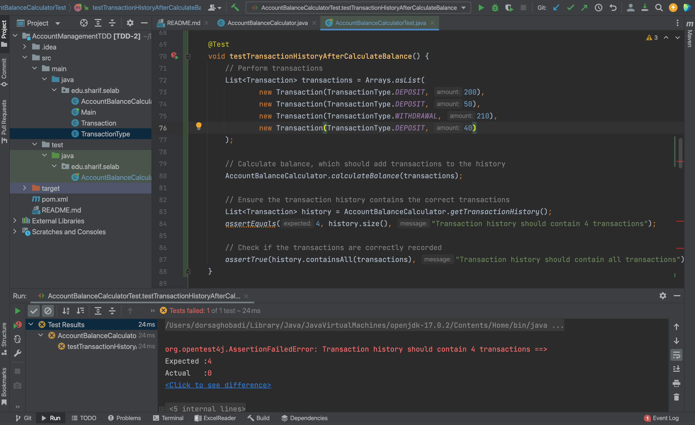

# مدیریت حساب بانکی  

## بخش اول 

# پرسش اول   

خطای موجود در کد این است که در تابع `calculateBalance`، 
انتظار می رود که اولا، تاریخچه تواکنش ها پاک و خالی شود، ثانیا باید بعد از حساب کردن موجودی بعد از هر تراکنش ، آن تراکنش به لیست سوابق افزوده شود که این اتفاق نیوفتاده است.  
دلیل دیده نشدن این مشکل میتواند این باشد که `coverage` کد صددرصد نیست، یعنی توابعی مانند `clearTransactionHistory`یا `addTransaction` وجود دارند که تست نشده اند که این احتمال وجود خطا را بالا می برد.
# پرسش دوم
برای آن که تستی بنویسیم که مردود شود و خطا را نشان دهد، کافیست که یک سری تراکنش انجام دهیم، سپس موجودی را حساب کنیم و در آخر چک کنیم که آن تراکنش ها در سوابق تراکنش وجود دارند یا نه.  
این تست در تابع `testTransactionHistoryAfterCalculateBalance` قابل مشاهده است.  
قبل از اصلاح کد، تست مردود می شد که در تصویر زیر قابل مشاهده است:  
  

سپس، کد را اصلاح میکنیم ، به این صورت که در تابع`calculateBalance` ، باید اولا در ابتدای کار ، سوابق تراکنش را پاک کنیم تا تراکنش های جدید را اضافه کنیم، سپس بعد از انجام هر تراکنش، آن را به لیست سوابق اضافه کنیم:  

  

حالا با تغییرات اعمال شده ، انتظار می رود که تست ما پاس شود :   

  

# پرسش سوم

نوشتن آزمون پس از نوشتن برنامه می‌تواند این مشکلات را ایجاد کند:

1. احتمال نادیده گرفتن برخی سناریوها یا خطاها، چون ذهن توسعه‌دهنده درگیر پیاده‌سازی فعلی است و نه تمام حالات ممکن.
2. دشوار شدن طراحی آزمون‌های جامع، چون کد موجود ممکن است تست‌پذیر نباشد و نیاز به تغییرات پرهزینه داشته باشد.
3. افزایش احتمال کشف دیرهنگام باگ‌ها، که باعث صرف زمان و هزینه بیشتر برای اصلاح می‌شود.

# بخش دوم

با اعمال همان تغییراتی که در قسمت قبل انجام دادیم، حالا تست هایی که کامنت شده بودند را از حالت کامنت خارج میکنیم و دوباره اجرا میکنیم:  

همانطور که از تصویر پیداست ، همه ۱۰ تست نوشته شده پاس شده اند.  

---
### **پرسش چهارم: نوشتن موارد آزمون پیش از کدنویسی، چگونه کار ساخت برنامه را (نسبت به روش قبل) تسهیل کرد؟**

نوشتن آزمون‌ها قبل از پیاده‌سازی کد، فرایند توسعه را به شکل چشمگیری بهبود بخشید و چالش‌هایی که در بخش اول با آن مواجه بودیم را برطرف کرد. این رویکرد کار را از چند جهت کلیدی تسهیل کرد:

۱. **تبدیل نیازمندی‌ها به اهداف شفاف و قابل اندازه‌گیری:**
در روش اول (کدنویسی قبل از تست)، ما یک تصور کلی از عملکرد تابع `calculateBalance` داشتیم، اما جزئیات حیاتی مانند مدیریت `transaction_history` را نادیده گرفتیم. در رویکرد دوم (تست‌محور)، قبل از نوشتن حتی یک خط کد برای تابع، مجبور بودیم آزمونی بنویسیم که رفتار دقیق آن را تعریف کند. این آزمون به ما می‌گفت:
   - **ورودی:** لیستی از تراکنش‌ها.
   - **خروجی مورد انتظار:** موجودی نهایی صحیح.
   - **اثر جانبی (Side Effect) مورد انتظار:** لیست `transaction_history` باید **دقیقا** حاوی تراکنش‌های پردازش‌شده در همین فراخوانی باشد و نه تراکنش‌های قبلی.
این کار، نیازمندی‌های مبهم را به یک **قرارداد (Contract)** شفاف تبدیل کرد که کد ما ملزم به رعایت آن بود. در نتیجه، خطایی که در بخش اول به دلیل عدم پاک‌سازی تاریخچه رخ داد، در این روش اصلاً به وجود نمی‌آمد، زیرا آزمون از ابتدا جلوی آن را می‌گرفت.

۲. **طراحی کد با قابلیت تست‌پذیری بالا (High Testability):**
وقتی تست را اول می‌نویسیم، به طور طبیعی کدی می‌نویسیم که تست کردن آن آسان باشد. برای مثال، برای بررسی `transaction_history` در آزمون، باید مطمئن می‌شدیم که این لیست از خارج از کلاس `BankAccount` قابل دسترسی است. این ذهنیت ما را به سمت یک **معماری تمیزتر و ماژولارتر** سوق می‌دهد. در مقابل، وقتی کد را اول می‌نویسیم، ممکن است تمام متغیرها را خصوصی (private) کنیم و دسترسی به آن‌ها را برای تست دشوار سازیم، که این کار در آینده نیازمند تغییرات پرهزینه در ساختار کد (Refactoring) خواهد بود.

۳. **کاهش زمان دیباگ و افزایش سرعت توسعه:**
در روش اول، پس از نوشتن کد و اجرای دستی، با یک باگ مواجه شدیم و باید زمان صرف می‌کردیم تا ریشه مشکل را پیدا کنیم. اما در روش TDD، **حلقه بازخورد (Feedback Loop) بسیار کوتاه است**:
   - **قرمز (Red):** یک تست کوچک و مشخص می‌نویسیم که شکست می‌خورد.
   - **سبز (Green):** حداقل کد لازم را برای پاس شدن همان تست می‌نویسیم.
   - **اصلاح (Refactor):** کد را تمیز و بهینه می‌کنیم در حالی که مطمئن هستیم تست‌ها همچنان پاس می‌شوند.
این چرخه باعث می‌شود خطاها در همان لحظه شناسایی و رفع شوند و هرگز با یک باگ بزرگ و ناشناخته در انتهای کار مواجه نشویم. این کاهش چشمگیر زمان دیباگ، در عمل سرعت کلی توسعه را بالا می‌برد.

---
### **پرسش پنجم: در نهایت به نظر شما، روش توسعه مبتنی بر آزمون، چه مزایا و معایبی دارد؟**

بر اساس تجربه‌ای که در این پروژه به دست آمد، می‌توان مزایا و معایب زیر را برای روش توسعه مبتنی بر آزمون (TDD) برشمرد:

#### **✅ مزایا (Advantages):**

* **افزایش چشمگیر کیفیت و اطمینان (Higher Quality and Confidence):** مهم‌ترین مزیت، اطمینانی است که از عملکرد صحیح کد به دست می‌آید. وقتی تمام ۱۰ آزمون پروژه با موفقیت پاس شدند، ما مطمئن بودیم که توابع اصلی، از جمله موارد پیچیده‌تر، دقیقاً همانطور که انتظار می‌رود کار می‌کنند. این مجموعه تست‌ها مانند یک **تور ایمنی (Safety Net)** عمل می‌کند که هنگام اضافه کردن ویژگی‌های جدید یا بهینه‌سازی کد، از بروز خطاهای ناخواسته در بخش‌های دیگر جلوگیری می‌کند.

* **مستندات زنده و کاربردی (Living Documentation):** خود تست‌ها بهترین مستندات برای کد هستند. هر کسی که بخواهد با کلاس `BankAccount` کار کند، با خواندن فایل تست‌ها (`test_bank_account.py`) می‌تواند به سرعت و با مثال‌های عملی بفهمد که هر تابع چه کاری انجام می‌دهد، چه ورودی‌هایی می‌پذیرد و چه خروجی‌هایی تولید می‌کند. این مستندات همیشه به‌روز هستند، زیرا اگر با کد اصلی همخوانی نداشته باشند، تست‌ها شکست می‌خورند.

* **تسهیل نگهداری و توسعه‌پذیری (Easier Maintenance & Scalability):** تصور کنید بخواهیم منطق محاسبه کارمزد را به تابع `addTransaction` اضافه کنیم. در روش سنتی، این تغییر می‌توانست ناخواسته بر عملکرد `calculateBalance` تأثیر بگذارد. اما با وجود تست‌ها، پس از اعمال تغییر، کافیست همه تست‌ها را اجرا کنیم. اگر همه آن‌ها سبز باقی بمانند، با اطمینان بالا می‌دانیم که تغییر ما هیچ چیز دیگری را خراب نکرده است.

#### **❌ معایب (Disadvantages):**

* **افزایش زمان اولیه برای پیاده‌سازی (More Upfront Time):** نوشتن تست قبل از کد، به خصوص در ابتدا، زمان‌بر است. برای یک تابع ساده، ممکن است حس کنید که حجم کد تست از کد اصلی بیشتر است. این سرمایه‌گذاری زمانی در ابتدای کار، ممکن است برای پروژه‌های بسیار کوچک یا نمونه‌سازی‌های سریع (Prototypes) سنگین به نظر برسد.

* **نیاز به تغییر نگرش و مهارت (Requires a Shift in Mindset):** تفکر بر اساس "اول تست" برای توسعه‌دهندگانی که به روش سنتی عادت دارند، می‌تواند در ابتدا چالش‌برانگیز باشد. چرخه "قرمز-سبز-اصلاح" نیازمند تمرین است و ممکن است در ابتدا سرعت کار را کندتر کند تا زمانی که به یک عادت تبدیل شود.

* **شکنندگی تست‌ها در صورت تغییر نیازمندی‌ها (Brittle Tests on Requirement Changes):** اگر نیازمندی‌های اصلی پروژه تغییر کند (مثلاً، تعریف "تراکنش" به طور کلی عوض شود)، نه تنها باید کد اصلی را بازنویسی کنیم، بلکه تعداد زیادی از تست‌های نوشته‌شده نیز باید از نو طراحی و نوشته شوند. این کار می‌تواند حجم دوباره‌کاری را افزایش دهد.

* **عدم پوشش کامل همه انواع خطاها:** TDD در شناسایی خطاهای منطقی (Logic Errors) عالی عمل می‌کند، اما لزوماً جلوی خطاهای سطح بالاتر مانند مشکلات یکپارچه‌سازی (Integration Issues) بین چند ماژول یا مشکلات عملکردی (Performance Issues) را نمی‌گیرد. این روش باید با سایر انواع تست تکمیل شود.

